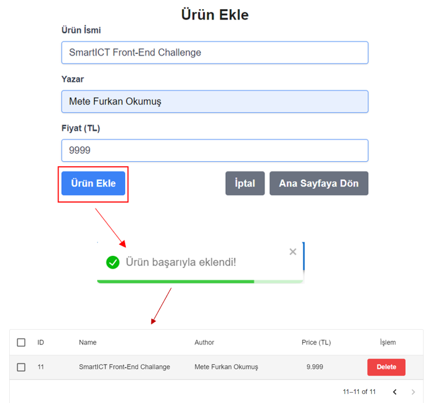

# SmartICT Front-End React Project

## Project Overview
This project is a Front-End React application developed for SmartICT company.

### Technologies Used:
- **React-Router-Dom:** Used for routing within the application.
- **Context API:** Utilized for state management.
- **Tailwind CSS:** Chosen for styling the application.
- **Material UI:** Employed for creating visually appealing product listings.
- **React-Toastify:** Used for pop-up notifications.

## Project Description
1. **Features:**
   - The project consists of a navbar, a product listing table, and an add product button.
     
   
   
2. **Default Data:**
   - Initially, there are 10 default products stored in local storage.

3. **Product Listing:**
   - Products are listed in a table using Material UI library.
   - Users can search products by name and sort them by price.
   - Pagination is implemented, displaying 5 products per page.

   

4. **Adding Products:**
   - Clicking on the add product button redirects the user to the add product page.
   - After entering the product details, clicking the add product button saves the product information to local storage with a new ID.

   

5. **Form Control:**
   - Users will encounter a warning message under the form if they try to submit without filling in the required fields. Additionally, if they try to add a product without filling in any fields, an error message will appear.

    

   
6. **Deleting Products:**
   - User can delete products by clicking delete button on the listing table

    

7. **Functionality:**
   - The project fulfills most of the required features effectively.

